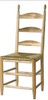
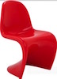

# 第1章 话说简单

## 简单的力量

2007年，乔纳森.卡普兰(Jonathan Kaplan)和艾瑞.布朗斯坦(Ariel Braunstein)敏锐的意识到当时的便携式摄像机已经变得复杂难用，大家可能只想拍一些视频花絮传到视频网站~~（Youtobe，该网站不存在需要自备梯子）~~分享给亲朋好友。于是设计了一款叫Flip的简单的便携式摄像机，一年左右占领了美国的1/6的摄像机市场。

Flip的目标就是尽可能的简单，甩开一切不必要的功能。没有连接线，只有一个弹出式的USB接口，整个机身只有9个操作键，其中还包括一个大大的红色录像键。

像File、早期的大众甲壳虫汽车以及Twitter这样简单的产品，都会对市场产生深远的影响。它们简单应用，因此能够为大众所接受；它们值得信赖，因此会赢得用户；它们适应性强，因此总会发展处别具一格的应用方式。

**人们喜欢简单、值得信赖、适应性强的产品。**

## 不是那种简单法

大部分的时候，我们设计产品功能的所谓简单，通常是将复杂的压力转嫁到这个产品的另外一部分人的身上。

比如，有些内部管理系统的设计人员，为了给管理者便利，为普通员工设计了非常复杂的表单和流程。

所以，我们在做技术产品设计时，至少要有3个角度：管理人员、工程师和用户。

而且，一个人在一种情况下觉得简单的事物，换一个人或者一种情况，可能就不会觉得简单了。

比如，你让一位开F1赛车的车手开简单得多的小Mini轿车去比赛，恐怕他怎么也不会觉得容易。

虽然为富有经验的用户设计复杂系统是一个好玩的题目，但是只有脱离了专家的掌控并为广大用户考虑，技术才会真正变得有意思起来，才能更好的推广和传播你的产品。

**独轮车是比自行车简单，但是你自己骑骑试试试？**

## 特征

简单并不意味最少话。朴素的设计仍然具有自身的特征和个性。

用料、对关键要素的强调，甚至组合几个要素的方式，都会直接影响到最终设计。人们能够识别出差异，并为这些差异赋予相应的价值。

    简单并不意味着欠缺或低劣，也不意味着不注重装饰或者完全赤裸裸。而是说装饰应该紧密贴近设计本身，任何无关紧要的要素都应该给予以剔除。
            -- Paul Jacques Grillo ( Form, Function and Design)

简单的特征和个性应该源自你使用的方法、要表现的产品，以及用户执行的任务。

  **这两把椅子都很简单，但是各有各的独一无二的特征。**

## 貌似简单

貌似简单的例子随处可见。“减肥药”、“高尔夫俱乐部的激光瞄准镜”以及“足不出户发大财”的方案等。这些貌似简单的东西没有一个应验的。相反，它们的存在芳儿让事情变得更复杂，效果更差。

热衷于做表面文章的人，永远不会创造出简单的用户体验来。

**简单可不是这种能够粘在用户界面上的装饰。**

## 了解自己

大多数的公司都是按照一个方程式进行运作的。例如：

    （销量）x （单价） - （成本） = （利润）
    
你要搞清楚建行用户体验将会如何影响方程式中的每一项。到底是能够增加销量，还是能够提高价格，还是能够降低成本。而且还需要将这些改变排出先后次序（比较好的做法是对每项改变的重要性和可行性进行评估）。