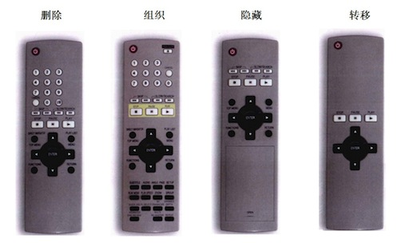

# 四个策略

简化DVD遥控器的方案，大致分为四大类

1. 删除 -- 去掉所有不必要的按钮，直至减到不能再减。
2. 组织 -- 按照有意义的标准将按钮划分成组。
3. 隐藏 -- 把那些不是最重要的按钮安排在活动仓盖之下，避免分散用户注意力。
4. 转移 -- 只在遥控器上保留具备最基本功能的按钮，将其它控制器转移到电视屏幕上的菜单里，从而将复杂性转移到电视。

这四个策略适用于简化功能，也适用于简化内容。而且，无论项目大小--是整个网站，还是其中一个页面，这四个策略都同样适用。

